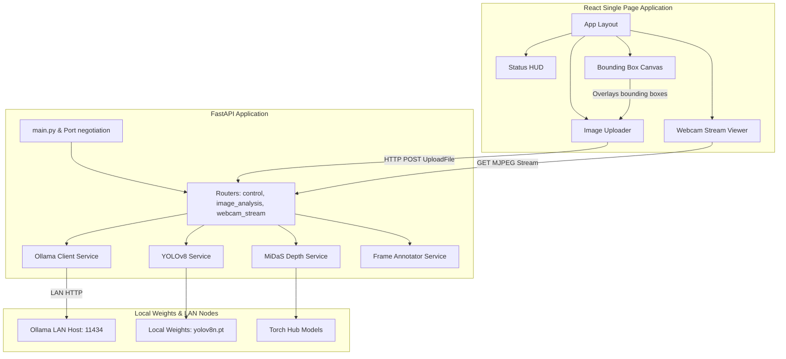

# Agent Guidelines & Repository Architecture: cv_tools

Welcome! This document serves as the developer blueprint and agent alignment guide for the `cv_tools` workspace. It details the workspace's architecture, ML models, API contracts, frontend UI/UX requirements, coding conventions, and operational workflows.

---

## 1. Workspace Overview

The `cv_tools` repository is a centralized suite of computer vision utilities and applications. It is divided into three key components:
1. **`CV_image`**: A lightweight CLI tool for still-image face detection using OpenCV's DNN module.
2. **`CV_stream`**: A webcam-based live tracking system supporting OpenCV Caffe SSD and YOLOv8 models in both standalone and client-server architectures.
3. **`cv-detection-app`**: A full-stack, LAN-aware web application combining still-image reasoning via Ollama multimodal models (e.g., Llava, Moondream) and live webcam streaming annotated with local YOLOv8 object detection and MiDaS monocular depth estimation.

### Core Architecture Map


---

## 2. Directory & Module Architecture

Below is the directory tree highlighting the key files and folders in the workspace:

```
cv_tools/
├── .agents/
│   └── AGENTS.md               <-- [This File] Custom rules & architectural blueprint
├── agents.md                   <-- Symbolic link or duplicate of AGENTS.md for CLI access
├── README.md                   <-- Repository high-level user guide
├── CV_image/                   <-- Local face detection CLI utility
│   ├── deploy.prototxt         <-- OpenCV DNN Caffe configuration
│   ├── face_detector.py        <-- SSD-based CLI detector
│   └── res10_300x300_ssd_iter_140000.caffemodel  <-- Model weights
├── CV_stream/                  <-- Webcam tracking (standalone & client/server)
│   ├── tracker.py              <-- Standalone local window webcam tracker
│   ├── tracker_server.py       <-- Flask-based streaming server (Face/YOLO)
│   ├── tracker_client.py       <-- Network display client for Flask server
│   ├── run_server.sh           <-- Startup script running server in background (detached)
│   └── shutdown.sh             <-- Graceful cleanup of detached servers
└── cv-detection-app/           <-- LAN-aware Web Application
    ├── architecture.md         <-- Architectural Decision Record (ADR)
    ├── docker-compose.yml      <-- Docker compose configuration
    ├── start.sh / stop.sh      <-- Launch and teardown scripts
    ├── backend/                <-- FastAPI Python Backend
    │   ├── main.py             <-- Uvicorn entrypoint & Ollama health check loop
    │   ├── requirements.txt    <-- Python dependencies
    │   ├── routers/            <-- Endpoints
    │   │   ├── control.py      <-- Health, status, and shutdown
    │   │   ├── image_analysis.py <-- Ollama-based static analysis
    │   │   └── webcam_stream.py  <-- Live YOLO + MiDaS streaming
    │   └── services/           <-- Model wrappers
    │       ├── depth_estimator.py <-- MiDaS depth extraction
    │       ├── frame_annotator.py <-- HUD & bounding box overlay generator
    │       ├── ollama_client.py   <-- HTTP interaction with Ollama
    │       └── yolo_detector.py   <-- Non-blocking YOLOv8 wrapper
    └── frontend/               <-- Vite + React + TypeScript Frontend
        ├── tailwind.config.cjs <-- Styling overrides
        └── src/
            ├── App.tsx         <-- Page router and core layout
            ├── components/     <-- Shared UI components
            │   ├── BoundingBoxCanvas.tsx <-- Responsive relative BB drawing
            │   ├── ErrorPanel.tsx   <-- Error messages and details
            │   ├── ImageUploader.tsx <-- Drag & drop with local preview
            │   ├── StatusHUD.tsx    <-- Health status dashboard
            │   └── WebcamStream.tsx  <-- Live MJPEG stream wrapper
            └── pages/          <-- Views
                ├── ImageAnalysisPage.tsx <-- Image analysis dashboard
                └── WebcamPage.tsx        <-- Live stream portal
```

---

## 3. UI Component Details & Specifications

The frontend uses Vite + React + TypeScript + Tailwind CSS and the *Inter* font. The interface is optimized to feel responsive, robust, and live.

### A. Status HUD (`StatusHUD.tsx`)
- **Purpose**: Displays real-time statuses of the backend, webcam hardware, and Ollama connections, providing an operations dashboard.
- **Implementation & API Calls**:
  - Polls `GET /api/status` every `5000ms` using `setInterval`. Disposes of the timer on unmount.
  - Triggers on-demand health check calls to `POST /api/ollama/check` with a loading state (`Checking...`).
  - Calls `GET /api/ollama/models` to query and list models currently cached/available on the Ollama host.
- **UI Details**:
  - Divided into visual cards: **Application Status** (Host, Port, Webcam Active flag, local models loaded) and **Ollama Connectivity** (Endpoint URL, Reachable flag, HTTP Status, Last checked timestamp).
  - Displays the raw JSON block returned by the last Ollama model probe inside a `<pre>` element with a scrollable container (`max-h-40 overflow-auto`) and background shade (`bg-gray-50`) for debugging.
  - Dynamic button states: Disables checking button while loading, uses contrast colors (`bg-blue-600` for main trigger, `bg-gray-200` for controls).

### B. Image Uploader (`ImageUploader.tsx`)
- **Purpose**: Facilitates uploading a JPEG image, performing health checks, sending the image payload, and handling errors.
- **UI Details**:
  - Offers a clean input selector accepting `.jpg`/`.jpeg` formats.
  - Automatically generates an object URL (`URL.createObjectURL(file)`) to display a fast local client-side preview image.
  - Checks if Ollama is reachable before allowing the user to initiate the analysis (disabled state for "Analyze Image" button if `ollamaReachable === false`).
  - Shows a progress indicator state (`Analyzing...`) during the multipart upload API request.
  - Displays an integrated [ErrorPanel](file:///home/dlh/dlhdev/cv_tools/cv-detection-app/frontend/src/components/ErrorPanel.tsx) with a collapsable detail box to trace server-side exception stack traces without breaking the UI layout.

### C. Bounding Box Canvas (`BoundingBoxCanvas.tsx`)
- **Purpose**: Overlays bounding boxes on the uploaded static image based on coordinate structures returned by the Ollama API.
- **UI Details**:
  - Positioned absolutely (`position: absolute; top: 0; left: 0`) and covers 100% width and height of the image canvas.
  - Reads detections containing labels and relative coordinate boundaries: `box_2d` coordinate ranges (represented by coordinates typically scaled `0-1000` or normalized coordinates `0.0-1.0` depending on model).
  - **Dynamic Scaling Rule**: Must resize canvas and dynamically scale coordinate maps matching the layout size of the HTML `` tag on screen (calculates client width/height ratios) so boxes stay aligned during viewport resizing.

### D. Webcam Stream Viewer (`WebcamStream.tsx`)
- **Purpose**: Plays and manages the MJPEG stream generated by the FastAPI `/api/stream` endpoint.
- **UI Details**:
  - Live stream is loaded inside a native HTML `` tag.
  - **Streaming Lifecycle Management**:
    - *Start*: Sets `img.src = '/api/stream'` to instruct the browser to open the multipart HTTP connection.
    - *Stop*: Explicitly clears the image source (`img.src = ''` and `img.removeAttribute('src')`) to tell the browser to close the socket and cancel the background transfer.
  - Exposes control buttons to **Start Stream** and **Stop Stream**.
  - Renders a badge displaying the connection status (badge turns green/gray according to `streaming` state).
  - Provides a direct link (`Open raw stream` targetting `_blank`) to access the stream in a separate tab if the inline component encounters layout/loading issues.

---

## 4. Backend System & Model Reference

### Port Negotiation & `.port_binding`
The backend leverages an automatic port finder to avoid bind conflicts:
1. Tries to bind to the preferred port (`APP_PORT_PREFERRED`, default `8080`).
2. If in use, scans the fallback range (`APP_PORT_FALLBACK_RANGE`, e.g., `8081-8090`).
3. Once successfully bound, writes the hostname and port into the `.port_binding` file in the project root. The frontend API client reads this file or utilizes local discovery.

### Model Configurations
- **Face Detection (OpenCV SSD)**:
  - Caffe deployment network. Loads configuration from `deploy.prototxt` and weights from `res10_300x300_ssd_iter_140000.caffemodel`.
  - Runs inference on an image matrix sized to `300x300`.
- **Object Detection (YOLOv8)**:
  - Uses Ultralytics library (`yolov8n.pt` downloaded automatically on first launch).
  - Configured to filter target classes (e.g., `person`, `dog`, `cell phone`).
- **Depth Estimation (MiDaS)**:
  - Monocular depth estimation network loaded via `torch.hub`.
  - Computes depth maps per frame, normalized and mapped to OpenCV colormaps (e.g., `cv2.COLORMAP_INFERNO` or `COLORMAP_VIRIDIS`) to overlay distance indicators on the streaming view.
- **Multimodal (Ollama)**:
  - Offloads complex semantic queries (e.g., detailed object layout and visual description) to models like `llava:13b` or `moondream` hosted on a LAN instance.
  - Queries are formatted to request JSON output schemas.

---

## 5. Development Guidelines & Standards

### Coding Styles
- **Python**:
  - Enforce explicit type annotations for function signatures.
  - Ensure all external resources (e.g., `cv2.VideoCapture`) are released properly inside `finally` blocks or using context managers.
  - Use `asyncio` for non-blocking I/O operations (like communicating with Ollama). For CPU-intensive operations (such as running YOLO models on frames), run them in a separate thread pool executor using `asyncio.to_thread` or FastAPI's `BackgroundTasks`.
- **TypeScript & React**:
  - Use functional components with hooks (`useState`, `useEffect`, `useCallback`).
  - Declare strict types or interfaces for component props and API payloads (avoid lazy `any` types where possible).
  - Manage network requests using the pre-configured [api client](file:///home/dlh/dlhdev/cv_tools/cv-detection-app/frontend/src/lib/api.ts) instance. Always inject custom debug headers (e.g., `X-Debug`) to track sources in the API logs.

### Testing & Verification
- Prior to pushing changes, verify that the backend tests pass:
  ```bash
  pytest cv-detection-app/backend
  ```
- Always perform manual checks on the web app to ensure:
  - The webcam stream releases correctly in the browser when clicking **Stop Stream**.
  - Canvas overlays scale properly when resizing the browser window.
  - Port fallback negotiates correctly if multiple server instances are launched.
