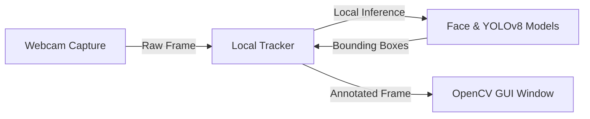
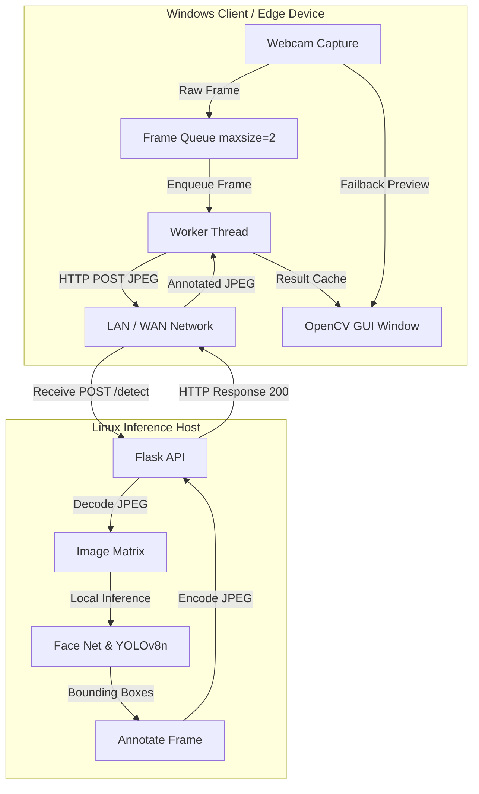

# CV Stream: Real-Time Computer Vision Pipeline

A cross-platform, self-bootstrapping computer vision system that performs real-time face tracking and object detection (YOLOv8). The application is designed to run in either a standalone local mode or a distributed client-server configuration, optimizing compute resources by offloading machine learning inference to a dedicated server while keeping the video capture interface highly responsive.

---

## 📌 System Behavior

1. **Self-Bootstrapping Environment**
   On the first launch of any component (`tracker.py`, `tracker_server.py`, or `tracker_client.py`), the system automatically checks for the required dependencies. If they are missing, it initializes a local virtual environment (`.venv`), upgrades `pip`, installs the appropriate requirements, and automatically re-launches itself within the context of the new virtual environment. No manual `virtualenv` configuration or `pip install` commands are required.

2. **On-Demand Model Fetching**
   Models are downloaded automatically when first needed:
   - **OpenCV Face Detector**: Downloads the deployment prototxt and pre-trained Caffe weights (`res10_300x300_ssd_iter_140000.caffemodel`) to the local `models/` directory.
   - **YOLOv8n Object Detector**: Fetches the lightweight YOLOv8 nano pre-trained model weights (`yolov8n.pt`) on demand.

3. **Multi-Threaded Non-Blocking Frame Queue (Client)**
   To guarantee a smooth, real-time video display loop without network-induced freezing, the client utilizes a separate, background worker thread. Capturing runs at the hardware framerate, pushing frames to a queue with a maximum size of 2. If the inference server is slower than the camera capture speed, the client drops intermediate frames rather than letting the queue back up.
   
4. **Resiliency and Fail-Safes**
   - **HUD Connection Status**: The client monitors server response times. If the server does not reply within 3 seconds, the HUD indicator flips to red, displaying a warning message.
   - **Network Timeout Handling**: If connection issues occur, the worker thread backs off temporarily before retrying, ensuring the capture interface remains responsive.

---

## 🏗️ Architecture

The CV Stream architecture is designed to support both standalone and distributed execution paths.

### Standalone Mode (Local Pipeline)


### Distributed Mode (Client-Server Pipeline)


---

## 🎯 Use Cases

* **Local Debugging & Testing**: Run the standalone script on a single laptop with a webcam to test face/object tracking configurations locally.
* **Edge Device Acceleration**: Deploy the client on a low-power machine (e.g., a lightweight notebook or Raspberry Pi) to capture video, while offloading the heavy deep learning inference to a powerful desktop or server with GPU acceleration.
* **Surveillance and Robotics**: Capture streams from multiple remote cameras and process them concurrently or sequentially on a central Flask server.
* **Heterogeneous Cross-Platform Setup**: Capture video via Windows-optimized backends (`DSHOW`/`MSMF`) and execute GPU acceleration on a Linux server.

---

## 📦 Dependencies

The application manages dependencies automatically on a per-component basis, minimizing environment bloat.

| Dependency | Required By | Purpose | Minimum Version |
| :--- | :--- | :--- | :--- |
| **Python** | All Components | Runtime Engine | `3.8+` |
| **opencv-python** | All Components | Image processing, hardware capture, DNN Face model inference, and GUI display | `>=4.8` |
| **numpy** | All Components | Matrix manipulation and array buffers | `>=1.24` |
| **ultralytics** | Server / Standalone | YOLOv8 inference pipeline | `>=8.0` |
| **flask** | Server | HTTP API endpoint provider | `>=3.0` |
| **requests** | Client | Streaming image data payloads | `>=2.28` |

### Model Assets
The following files are downloaded automatically into the `models/` directory inside the project root:
* **Face Prototxt**: `models/deploy.prototxt`
* **Face Caffe Model**: `models/res10_300x300_ssd_iter_140000.caffemodel`
* **YOLOv8 Model**: `yolov8n.pt` (saved to the project root directory)

---

## 🚀 Launching & Implementation

### 1. Running in Standalone Mode
Run the unified tracker, which captures webcam video and processes inference locally.

**On Linux / macOS:**
```bash
./run.sh
```
*(Or manually via: `python3 tracker.py`)*

**On Windows:**
```cmd
run.bat
```
*(Or manually via: `python tracker.py`)*

---

### 2. Running in Distributed Mode

#### Step A: Start the Inference Server (Linux Host)
Run the server to host the detection endpoints. By default, it will list its own IP addresses so you can easily configure the client.

```bash
./run_server.sh [--host 0.0.0.0] [--port 5000]
```
*(Or manually via: `python3 tracker_server.py --host 0.0.0.0 --port 5000`)*

#### Step B: Start the Client (Windows Webcam Machine)
Launch the client and point it to your server's IP address.

**On Windows:**
Double-click `run_client.bat` or run it from a terminal:
```cmd
run_client.bat http://<SERVER_IP>:5000
```
If launched without arguments, the script will prompt you for the server URL. Alternatively, set the environment variable:
```cmd
set CV_SERVER=http://<SERVER_IP>:5000
run_client.bat
```

---

## 🔌 API Specification

The inference server exposes a simple, high-performance HTTP API.

### 1. Health Check
Checks the status of the server and verifies that the models are loaded.

* **Endpoint**: `GET /health`
* **Response Format**: `application/json`
* **Response Example**:
  ```json
  {
    "status": "ok",
    "face": true,
    "yolo": true
  }
  ```

### 2. Real-Time Detection
Receives raw image bytes, runs the requested pipelines, and returns the annotated image.

* **Endpoint**: `POST /detect`
* **Content-Type**: `image/jpeg`
* **Query Parameters**:
  * `faces` (optional, default `1`): Set to `0` to disable face detection.
  * `yolo` (optional, default `1`): Set to `0` to disable YOLOv8 detection.
* **Request Body**: Raw binary JPEG image payload.
* **Response Format**: `image/jpeg` (returns the annotated frame directly).

---

## 🎮 Interface & Interactive Controls

While the display window is active, the following controls are available to dynamically manipulate the pipeline state:

| Key | Action | Description |
| :---: | :--- | :--- |
| **`q`** or **`Esc`** | **Quit** | Shuts down the camera, closes display windows, and exits the application cleanly. |
| **`f`** | **Toggle Faces** | Dynamically toggles OpenCV DNN Face detection (Orange boxes). |
| **`y`** | **Toggle YOLO** | Dynamically toggles YOLOv8 detection (Green: Person, Amber: Dog, Magenta: Cell Phone). |

*Note: In client-server mode, toggling these controls updates the query parameters sent to the server, resulting in immediate bandwidth and compute savings on the server side.*

---

## 🛠️ Troubleshooting

* **No camera detected / Camera read failed**: 
  - Ensure your webcam is connected and not currently open in another app (like Teams, Zoom, or a browser).
  - If you have multiple cameras, the script automatically attempts indices `0-3` across platform-specific backends.
* **Client displays "WAITING FOR SERVER"**:
  - Verify that the Flask server is running and bound to `0.0.0.0` (all interfaces) rather than `127.0.0.1` (localhost).
  - Check your local network routing. Ensure the Windows client can ping the Linux server's LAN IP.
  - Verify that firewall rules on the server allow incoming TCP connections on port `5000`.
* **Python requirements errors**:
  - Delete the `.venv` directory and run the launcher script again to force a clean environment setup.
  - Ensure the base system has `python3-venv` installed (`sudo apt install python3-venv` on Ubuntu/Debian).
