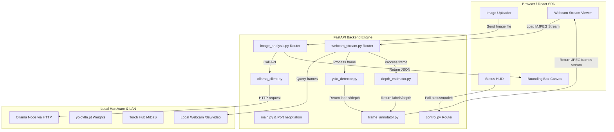

# Agent Guidelines & Component Architecture: cv-detection-app

This guide details the full-stack, LAN-aware computer vision application, detailing the FastAPI Python backend and the Vite React + Tailwind CSS frontend.

---

## 1. Architecture Flow Map



---

## 2. Backend Architecture & Service Layer

The backend uses Python 3.11+ and FastAPI. Services are designed to remain modular and decoupled from HTTP routes.

### Port Negotiation Logic
1. Reads `APP_PORT_PREFERRED` (default `8080`) from the environment.
2. Checks port availability. If occupied, scans the fallback range `APP_PORT_FALLBACK_RANGE` (e.g., `8081-8090`).
3. Writes the resolved host and port to `.port_binding` in the root folder so that frontend discovery or E2E scripts can read it automatically.

### Ollama Health Checker Daemon
- Spawns a background task on application startup (`asyncio.create_task` in `main.py`).
- Periodically pings the Ollama generate endpoint (`OLLAMA_HOST` + `/api/generate`) with a probe payload using `httpx.AsyncClient`.
- Caches the connection status (reachable, http status code, last check time) to satisfy instantaneous queries to `/api/status`.

### Models & Service Layer
- **`ollama_client.py`**: Handles async HTTP communication with Ollama. Formats queries to enforce structured JSON output models.
- **`yolo_detector.py`**: Encapsulates the Ultralytics YOLOv8 detector. CPU-intensive forward passes are offloaded using thread pool execution.
- **`depth_estimator.py`**: Loads MiDaS monocular depth estimation network via `torch.hub`.
- **`frame_annotator.py`**: Uses OpenCV to overlay YOLO bounding boxes, class labels, and normalize/map depth estimations to heatmaps (`cv2.COLORMAP_INFERNO`). Also calculates visual metrics and overlays a HUD directly on the video feed.

---

## 3. Frontend UI Component Specifications

The frontend uses Vite + React + TypeScript + Tailwind CSS and the *Inter* typography system.

### A. Status HUD (`src/components/StatusHUD.tsx`)
- Displays connectivity indicators for backend and local network Ollama engines.
- **Key Operations**:
  - Polls `/api/status` every `5000ms` using `setInterval`. Disposes of the timer on component unmount.
  - Exposes an interactive "Run Ollama Check" action button that sends a `POST /api/ollama/check` call, indicating load status (`Checking...`).
  - Calls `GET /api/ollama/models` on demand to fetch and list available LLM/multimodal models stored on the Ollama LAN node.

### B. Image Uploader (`src/components/ImageUploader.tsx`)
- Coordinates image file uploads and passes raw inference payloads to Parent components.
- **Key Operations**:
  - Implements an input element restricting selections to `.jpg`/`.jpeg` formats.
  - Automatically loads a local image preview via `URL.createObjectURL(file)`.
  - Disables the "Analyze Image" button if `ollamaReachable === false` to prevent redundant network calls.
  - Displays progress indicators (`Analyzing...`) during the multipart post upload request.
  - Incorporates the `ErrorPanel` component with toggleable error trace logs to debug server exceptions.

### C. Bounding Box Canvas (`src/components/BoundingBoxCanvas.tsx`)
- Overlays relative bounding boxes directly over the uploaded image.
- **Key Operations**:
  - Positioned absolutely to cover 100% of the underlying container width/height.
  - Translates and scales coordinate boundaries (e.g. `box_2d` from normalized `0.0–1.0` or scaled `0-1000`) dynamically using the client width and client height ratios of the HTML `` tag. This ensures boxes remain correctly aligned during viewport resizing.

### D. Webcam Stream Viewer (`src/components/WebcamStream.tsx`)
- Controls live streaming of annotated webcam frames.
- **Key Operations**:
  - Renders the MJPEG feed in a native HTML `` tag.
  - **Lifecycle Rules**:
    - **Start**: Sets the `src` attribute of the image element to `/api/stream` to initiate the browser's multipart stream fetch.
    - **Stop**: Explicitly sets `src` to `""` and invokes `removeAttribute("src")` to force the browser to disconnect the network transfer.
  - Displays inline status badges showing green/gray according to connection state.
  - Provides a fallback link pointing to `/api/stream` with `target="_blank"` to let users access the raw MJPEG stream directly.

---

## 4. Development Rules & Conventions

- **Types & Interfaces**: Avoid using the `any` type in TypeScript. Declare strict interfaces for component props, state hooks, and API JSON schemas.
- **API Request Headers**: Use the custom API client in [src/lib/api.ts](file:///home/dlh/dlhdev/cv_tools/cv-detection-app/frontend/src/lib/api.ts). Always include debug headers (e.g., `X-Debug: <source-action>`) to help trace the trigger source in backend console logs.
- **Resource Lifecycle**: Always clean up system resources (webcam handles, intervals, canvas events) to prevent performance issues and memory leaks.
- **Testing**: Before finalizing a change, ensure that all tests execute successfully:
  ```bash
  pytest cv-detection-app/backend
  ```
